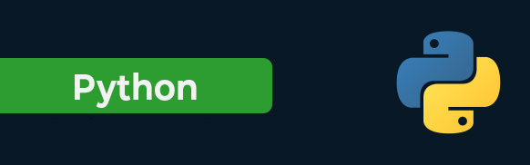

# Python-Learning



<details>
<summary><b>Getting Start with Python</b></summary>

Python is a high-level, interpreted programming language known for its simplicity and readability.Python is a popular programming language. It was created by Guido van Rossum, and released in 1991. It is used in machine learning, web development, desktop applications, and many other fields.

### <b>Getting Start with Python</b>
---

1. <code><b>Install Python:</b></code> At first, we need to download and install python. Make sure to download the latest version for our operating system.
2. <code><b>Choose a IDE:</b></code> For write our code we need to install text editor. Some popular Python IDEs include PyCharm, Visual Studio Code, and Jupyter Notebook. Visual Studio Code is better.
3. <code><b>Write First Python Program:</b></code></br>
   
    ```python
    print("Hello, Python!")
    ```
    Save this code in a file with a <code> .py </code> extension, such as <code>hello.py</code>
4. <code><b>Run Python Program:</b></code> To run Python program, open a terminal or command prompt, navigate to the directory where Python file is located, and then type python hello.py.

</details>

<details>
<summary><b>Input/Output in Python</b></summary>

### <b>Input in Python:</b>
---
<code>input(): </code>This function first takes the input from the user and converts it into a string. The type of the returned object always will be <class ‘str’>.

<b>Input Syntax:</b>

```python
name = input("Enter your name: ")

//integer or other
numer = int(input("Enter a number: "))
```

<b>For Multiple input:</b>

```python
# For multiple input
x, y = input("Enter two values: ").split()
print("Number of boys: ", x)
print("Number of girls: ", y)
```

### <b>Output in Python:</b>
---
Python print() function prints the message to the screen or any other standard output device.

```python
# Displaying text output
print("Hello, World!")
```

<b>Formatting Output:</b>

```python
# Using % operator for string formatting
name = "Alice"
age = 25

print("Hello, my name is", name, "and I am", age, "years old.")

# Using f-strings (Python 3.6+)
print(f"Name: {name}, Age: {age}")
```

<b>Print Concatenated Strings</b>

```python
print('Python is a Wonderful ' + 'Programming Language.')
```

</details>

<details>
<summary><b>Python Keywords and Identifiers</b></summary>

### <b>Python Keywords:</b>
---
Python, keywords are reserved words that have special meanings and purposes. These keywords cannot be used as identifiers (such as variable names or function names) in Python programs. Here's a list of all the keywords in Python:

| False | None | True | and | as |
|---|---|---|---|---|
| assert | async | await | break | class |
| continue | def | del | elif | else |
| except | finally | for | from | global |
| if | import | in | is | lambda |
| nonlocal | not | or | pass | raise |
| return | try | while | with | yield |

<b>Print Keywords by coding:</b>

```python
import keyword

keywords = keyword.kwlist

# Print the list of keywords
print("List of Python Keywords:")
for kw in keywords:
    print(kw)
```

### <b>Python Identifiers:</b>
---
In Python, an identifier is a name given to entities like variables, functions, classes, etc. It is used to identify and refer to these entities in the code. Here are the rules for naming identifiers in Python:

+ An identifier can only contain alphanumeric characters (a-z, A-Z, 0-9) and underscores (_). It cannot start with a digit.
+ Python is case-sensitive, so myVar and myvar are different identifiers.
+ Identifiers cannot be a reserved keyword. These keywords have special meanings in Python and cannot be used as identifiers.
+ There is no limit on the length of an identifier, but it's recommended to keep it concise and meaningful.

<b>Valid Identifiers</b>

```python
my_variable
myVar
my_function
MyClass
MY_CONSTANT
```

<b>Invalid Identifiers:</b>

```python
2variable -->(starts with a digit)
my-variable -->(contains a hyphen)
if -->(reserved keyword)
my variable -->(contains a space)
```

</details>

<details>
<summary><b>Variables in Python</b></summary>
In Python, a variable is a named storage location used to store data values. Variables are created when you assign a value to them using the assignment operator =. 

+ <code><b>Variable Assignment:</b></code> In Python, variables do not need to be declared with any particular type, and can even change type after they have been set.

    ```python
    x = 10          # Assigning an integer value
    name = "Alice"  # Assigning a string value
    is_valid = True # Assigning a boolean value
    ```
+ <code><b>Variable Reassignment:</b></code> We can change the value of a variable by assigning a new value to it.
  
  ```python
    x = 4       # x is of type int
    x = "Sally" # x is now of type str
  ```

+ <code><b>Variable Type Casting:</b></code> If we want to specify the data type of a variable, this can be done with casting.
  
  ```python
    x = str(3)    # x will be '3'
    y = int(3)    # y will be 3
    z = float(3)  # z will be 3.0
  ```

+ <code><b>Getting Type of Variable:</b></code> We can get the data type of a variable with the <code>type()</code> function.

    ```python
    x = 5
    y = "John"
    print(type(x))
    print(type(y))
    ```

+ <code><b>Multiple Assignment:</b></code> We can assign values to multiple variables in a single line using multiple assignment.
  
  ```python
    x, y, z = 10, 20, 30
  ```

</details>